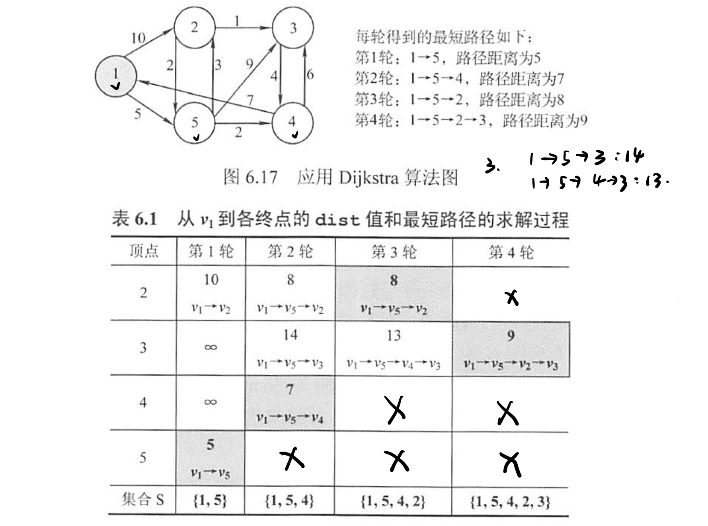

# 图论

## 图论的主要内容

在图论部分，我们需要掌握对图这一非线性数据结构的存储和表示。图的表示需要以图的基本概念作为支撑，但是一些比较基本的概念，不想在这里做过多的解释和记录，只把最容易弄混淆的概念进行自我记录。

在图的部分，我将按照一定顺序介绍我们的图论。

- 图的基本概念
- 图的基本存储结构

  - 邻接矩阵法
  - 邻接表法
- 图的遍历

  - DFS
  - BFS
- 图的应用

  - 最小生成树 Kruskal Prim
  - 最短距离 Dijkstra Floyd
  - 拓扑排序 AOV网
  - 关键路径 AOE网

## 图的基本概念及存储结构

在图中比较重要的概念就是图的连通性等概念，详见之前考研时写的文章：[连通性文章](https://blog.csdn.net/Mr_Yuwen_Yin/article/details/121449954)。

## 图的遍历

### 广度优先搜索的遍历 BFS

BFS 的概念在大二的时候就比较清楚了，这是一种类似树的层序遍历的过程，并且在遍历的过程中不需要节点回退，不是一个递归的算法。形象化记忆 BFS 的过程就像一滴水落在水面上，由中间及远的波纹就是 BFS 遍历的过程。

在 BFS 的实现，需要一个线性的数据结构——队列。队列用来存储与当前已遍历节点相邻的“后续"节点，这里的后续被加上了双引号，因为相邻节点中有的可能是已经被遍历访问过的，所以在程序实现中需要加上判断。

与后面介绍的 DFS 一样，我们使用了额外的存储辅助数组 visited[] 用来存储某个节点是否被访问的标志。这个标志有两个作用，其一，这个辅助数组是作为一个非连通图 BFS 中不同连通分量都能得到遍历的保证。其二，这个辅助数组是确定“后续"节点的必要存储空间。此外，我们需要两个函数实现 BFS 遍历的过程，因为一次 BFS 可以解决一个连通分量的遍历，我们如果是一个非连通图的话，需要多次调用 BFS 进行遍历。

此外，我们分析下复杂度。空间复杂度比较好分析，就是 V 。空间复杂度需要这么想，我们对每一个节点都进行了遍历，在遍历节点的同时我们访问了节点的相邻节点，访问相邻节点的过程就是把整个图的边访问了若干次（并不能保证每一条边仅被访问一次，但是每条边至少被访问了一次），所以如果我们采用邻接表法，空间复杂度是 V + E，如果采用邻接矩阵法就是 V^2 。

**小应用**

求解非带权图单源最短距离路径

### 深度优先搜索的遍历 DFS

DFS 的概念其实也比较好理解，但是在本科最开始学习这个概念的时候还是比较吃力，现在回头来看，也是不过如此。很多概念在从未接触时比较抵触是很正常的，为什么会这样？（面对结果）为什么要这样？（面对过程）这都是怎么来的？（溯源）

DFS 遍历的过程大致概括如下：从某一个节点出发，访问与该节点相邻的非被访问的一个另节点，再访问刚刚被访问节点相邻的未被访问的节点......当不能再往下遍历搜索时，回退上一次被访问的节点，如果还有相邻的未被访问的节点，则从该点开始继续搜索。从上述过程可以看出，这是一个标准的递归式算法，同样使用了辅助空间 visited[]，但是并没有使用其他额外的数据结构，并且 DFS 的复杂度分析和 BFS 的分析过程保持一致。

## 图的应用

### 最小生成树

#### Prim

步步为营。从某一个节点出发加入树 T，此时 T 中只有一个顶点，选择与此树 T 相邻的最短的边（相当于添加了一个顶点进入集合 T）每次操作后 T 中的顶点数和边数都增加1，直到图中所有的顶点都加入树 T 中，算法结束。由于 Prim 算法依赖于每一个顶点执行，所以适合用于**稠密图**。下面我们分析一个复杂度。对于时间复杂度而言，由于不依赖于边，所以为 v^2.

#### Kruskal

与 Prim 算法从顶点开始拓展最小生成树不同的是，Kruskal 算法是一种按照权值递增次序选择合适的边构造 MST 的方法。构造过程如下：首先初始时为只有 n 个顶点无边的非连通图，按照边的权值由小到大的顺序排列，不断选取当前未被选择且权值最小的边，如果该边依附的顶点落在 T 中不同的连通分量上，则将此边加入 T 中，否则舍弃该边进而选择下一条权值最小的边，直到所有的顶点都落在同一个连通分量中，算法结束。在 Kruskal 算法中，采用堆存储边的集合，每次选择最小权值的边只需要 log E 的时间，所以时间复杂度为 E log E.

### 最短路径

#### Dijkstra 求单源最短路径

首先 Dijkstra 算法适用的场景要清楚：该算法仅适用于没有负权值的边，可以有 0 权值的边。单源最短路径指的是：某一个顶点到其他所有顶点的最短路径。所有顶点间的最短路径：所有顶点到其他所有顶点最短路径。

Dijkstra 算法和 Prim 算法十分的相像。D 算法同样是从某一个顶点 v 入手，并维持一个集合 S，S 中记录着已求得的顶点 v 到其他各顶点最短路径的终点 s。每一次添加 s 至 S 中，我们都要修改 v 到 V-S 中顶点的最短路径长度值。也就是说，D 算法也是依赖于图的顶点，直到所有的顶点都加入 S 中，算法结束。

#### Floyd 求各顶点间最短路径

我们同样需要知道，Floyd 允许图中带负权值的边，但不允许带负权值的边组成的回路。带权无向图同样可以适用于 Floyd 算法，因为无向图可以视为双向的有向图。

### 拓扑排序

AOV 网：Activity on Vertex.用顶点表示活动，用边来表示活动的先后。而拓扑排序正是建立在 AOV 网的基础之上，对一个有向无环图的顶点序列的顶点进行排序，如果存在着 A 到 B 的路径，那么在排序中顶点 B 一定出现在顶点 A 的后面。
