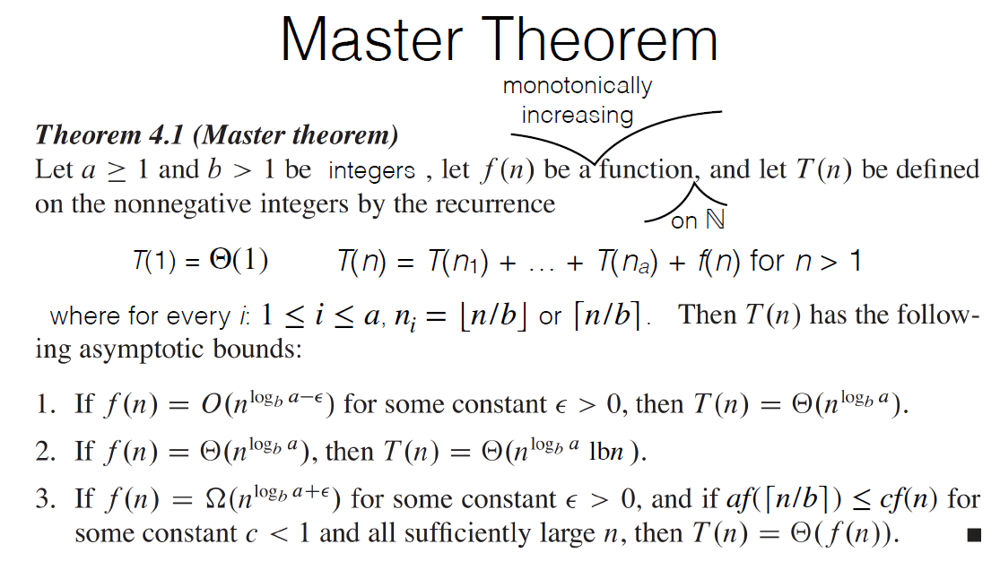
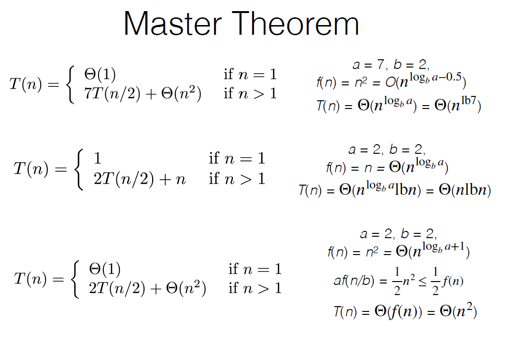

# 排序

## 分治算法

### Merge sort合并排序

合并排序的前提是把序列分开，随后合并两个有序序列。

### Maximum Subarray Problem最大子数组问题

没看懂。

### Strassen’s Algorithm

原始的时间复杂度是 $\Theta\left(n^{3}\right)$，经过算法处理后，变成了更多的矩阵加减法和少量的矩阵乘法，优化后的时间复杂度是 $\Theta\left(n^{lb 7}\right)$

## 解决递归等式复杂度的问题

例如有这样的一个递归的等式，该如何计算复杂度呢？我们可以尝试把它展开：
$$T(n)=\left\{\begin{array}{ll}
1 & \text { if } n=1 \\
2 T(n / 2)+n & \text { if } n>1
\end{array}\right.$$
假设 $n=2^k$ 展开得到：
$$\begin{aligned}
T(n) &=2 T(n / 2)+n \\
&=2\left(2 T\left(n / 2^{2}\right)+n / 2\right)+n=2^{2} T\left(n / 2^{2}\right)+n+n \\
&=2^{3} T\left(n / 2^{3}\right)+n+n+n \\
&=\ldots \\
&=2^{k} T\left(n / 2^{k}\right)+k n \\
&=2^{k} T(1)+k n=2^{k}+k n=n+n l b n=\Theta(n l b n)
\end{aligned}$$

## selection sort选择排序

选择排序，重在选择。n-1 趟选择，每一趟选择出最小元素的下标，随后将选择出来的下标和当前趟可并入有序列的下标对应的元素互换即可。复杂度：$o(n^2)$.

## insertion sort插入排序

维护两个序列，左侧是有序序列，右侧是无序序列。每次从无序序列中选择第一个元素在左侧序列中找到合适的位置插入即可。

## bubble sort冒泡排序

从头开始到尾，再次从头到尾-1，如此等等，如果碰到不符合顺序则交换。

## 堆排序Heaps

首先就是堆Heap的逻辑结构的定义，可以参照一个完全二叉树的定义去理解。大根堆就是堆顶比两个孩子节点的值大，小根堆类比可得。其次就是物理结构的设计，一个完全二叉树可以使用一个一维数组来存储，这个我们都清楚，堆同样可以使用一维数组存储。

### maintaining the heap property

MAX-HEAPIFY(A,i)从某个结点 i 出发，把以结点 i 为根的堆进行重新排序。主要的算法思想就是：找到结点 i 的左孩子和右孩子中最大的 largest，随后交换 i 和 largest 节点的值，达到调整堆、保持大根堆的特性。

需要注意的是，在调整大根堆之后，调整为孩子结点的 largest 之后的堆可能也需要进行调整，所以进行递归调用。

## build a max-heap

假设我们现在有一个一维数组 $A[1 \dots n]$，我们把这个数组调整为大根堆的形式。

## heapsort

首先建立一个堆，随后把堆最后一个元素和堆顶的元素交换得到当前堆的最大元素。

## Priority Queues

优先队列元素的 key 保存在 MAX-Heap 中，具体实现可见下图：

如果我们把 i 结点的 k 增加到 key，我们该如何调整这个堆呢？因为我们增大了 key 所以我们不必考虑 i 结点堆的特性，只需要向上进行递归调整堆即可。

## Quicksort